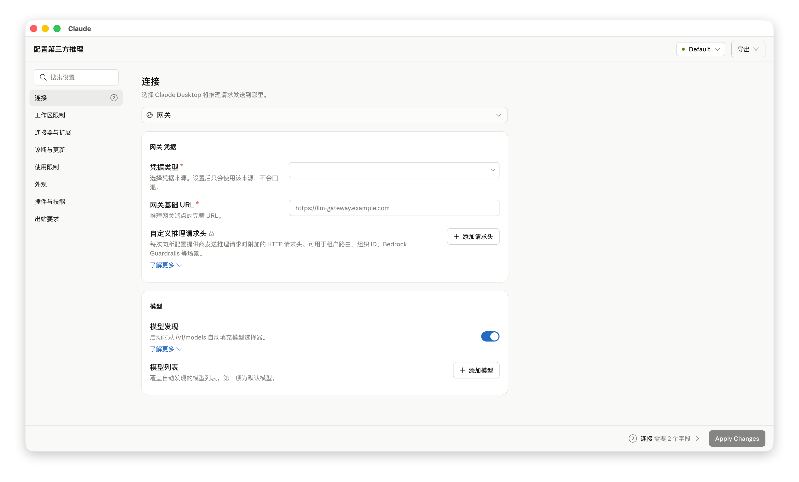
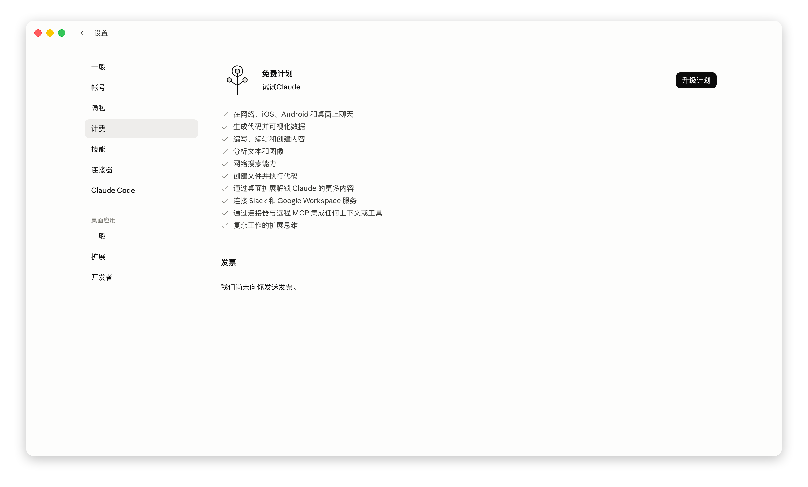
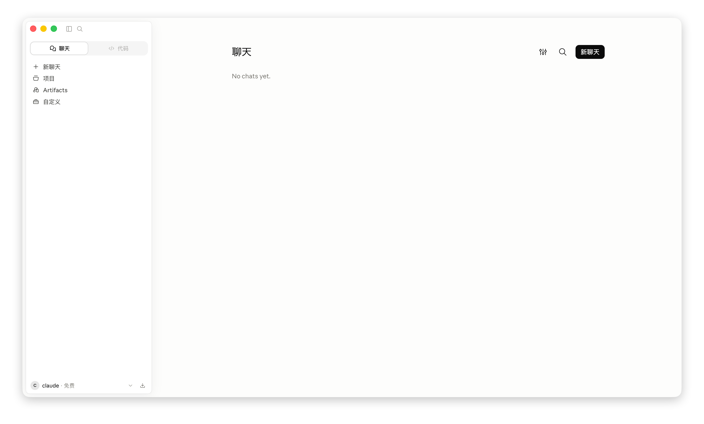

# Claude Desktop 中文补丁

给 Claude Desktop 换上简体中文界面。支持 Windows 和 macOS，支持官方订阅和第三方 API，可完整卸载恢复原样。

本轮更新针对 **Windows、简体中文、官方订阅账号登录**：补齐 Chrome 设置和订阅用量页，修复动态时间、百分比及词表大小写匹配，并保留思考等级的英文名称。安装不需要配置第三方 API。

**[下载当前修复源码 ZIP](https://github.com/Chrisutina/claude-desktop-zh-cn/archive/refs/heads/main.zip)**，解压后运行 `install-windows.bat`，选择 **2：官方账号登录模式（完整汉化）→ 1：简体中文**。重新安装后才会载入新词库，仅重启已有应用不会更新补丁。

补丁修改本机界面资源和语言配置，不修改 Claude 服务端账号数据，也不改变推理请求内容。模式 `[2]` 还会改写应用文件及其完整性哈希，详见下文。

## 界面截图





> 截图取自 Claude Desktop 2.2553.1。Claude 每次更新都可能新增文案，届时需要重跑补丁；更新后如果出现零星英文，见文末「Claude 更新后」。

## 汉化覆盖

界面翻译使用键值词库、模型动态词库和在线 DOM 映射：

| 界面层 | 随包资源 | 简体词条数 |
|---|---|---|
| 应用页面和设置 | `frontend-zh-CN.json` | 31,067 |
| 菜单、托盘和系统对话框 | `desktop-zh-CN.json` | 823 |
| 模型说明和思考选项 | `dynamic-zh-CN.json` | 49 |

这些是随包词条数量，不是当前客户端的覆盖率。安装时按目标版本英文词库合并，未覆盖的新键保留英文；在线页面也可能先于桌面客户端新增文案。具体修复和验证范围见 [Windows 官方订阅本地化说明](docs/windows-official-localization.md)。

`Low / Medium / High / Extra / Max` 和 `Effort` 保留英文；模型说明提供中文。代码块、用户消息、输入内容和权限策略的数据值不参与显示层翻译。

## 安装模式

只需要做一个选择：

### [1] 标准汉化

不修改 `app.asar` 和 `Claude.exe`，保留 Claude 的代码签名。

- 菜单栏、托盘、系统对话框、应用内界面：中文
- 不含：在线页面汉化、模型选择器汉化、第三方模型名校验绕过
- 用第三方 API 时，需要在网关或 CC Switch 中把模型名映射成 `claude-*` 风格的名称，否则推理配置无法保存

### [2] 官方账号登录模式（完整汉化）

改写 `app.asar`，并重算 `Claude.exe` 内嵌的完整性哈希。

- 在 [1] 的基础上，额外汉化在线页面、主进程菜单、模型选择器
- 适合官方订阅账号登录后的在线界面；第三方模型名能否使用仍取决于客户端和网关的校验规则
- Windows 上会改变 `Claude.exe` 的签名状态，可能使 Cowork VM 服务拒绝连接

官方订阅登录后需要在线页面汉化时，选择 `[2]`。需要保留代码签名或依赖 Cowork 沙箱时，优先选择 `[1]`，该模式不包含在线 DOM 翻译。

## Cowork 沙箱/工作区说明

Cowork 的可用性取决于当前客户端、系统虚拟化条件和服务的签名校验。模式 `[2]` 改写 `app.asar` 并同步 `Claude.exe` 的哈希，会使 Authenticode 校验显示 `HashMismatch`；Cowork 服务可能因此报 `RPC pipe closed`。

模式 `[1]` 不修改这两个文件，但也不会修复系统本身的虚拟化或服务问题。需要 Cowork 时，选择 `[1]` 并分别排查客户端和系统条件。

## 适用环境

- Windows 10/11，或 macOS
- 已安装 Claude Desktop
- macOS 需要 Python 3（优先用 `/usr/bin/python3`，没有则从 `PATH` 找 `python3`）
- Windows 需要系统自带的 Windows PowerShell（`powershell.exe`），批处理入口会自动请求管理员权限

## 使用方式

### Windows

1. 退出 Claude Desktop。
2. 下载或克隆本项目。
3. 双击 `install-windows.bat`，按 UAC 提示授权；脚本会先把安装文件复制到临时目录再以管理员身份运行。
4. 选择安装模式；官方订阅账号的在线界面选择 `2` 官方账号登录模式，详见上文「安装模式」。
5. 选择语言：`1` 简体中文、`2` 繁体中文（中国台湾）、`3` 繁体中文（中国香港）。
6. 脚本会先尝试从旧备份恢复以清理上一轮汉化；没有旧备份时跳过并继续。
7. 脚本会备份被修改的文件、写入中文资源并重启 Claude Desktop。
8. 如果没有自动切换，打开左下角账号菜单，选择 `Language` → 对应的中文选项。

其他菜单项：

- `3` Frida 运行时汉化（实验）：不修改磁盘上的 `app.asar` / `Claude.exe`，用 Frida 内存补丁加 CDP 注入在线页面 DOM 翻译。若本机缺 Python + frida，会提示下载便携运行时到 `%LOCALAPPDATA%\claude-zh\runtime`。需要本机允许 Frida 注入，**不适合当普通安装方式**。
- `4` 恢复原样 / 卸载补丁。
- `5` 自动更新设置：`y` 禁止自动更新，`n` 允许。
- `6` CC Switch skills 同步：`y` 把 `%USERPROFILE%\.cc-switch\skills` 中缺失的 skill 软链接进 Claude Desktop 的本地 skills 目录；`n` 只删除之前同步产生的软链接和记录，不动 CC Switch 源目录。

### macOS

1. 退出 Claude Desktop。
2. 下载或克隆本项目。
3. 双击 `install-mac.command`，选择安装模式（`1` 标准汉化 / `2` 完整汉化）。
4. 选择语言：`1` 简体中文、`2` 繁体中文（中国台湾）、`3` 繁体中文（中国香港）。
5. 按提示输入登录密码（选项 `1`/`2`/`4`/`5` 需要）。
6. 安装完成后 Claude 会自动重新打开。
7. 如果没有自动切换，打开左下角账号菜单，选择 `Language` → 对应的中文选项。

其他菜单项与 Windows 相同（`3` Frida、`4` 恢复、`5` 自动更新、`6` CC Switch skills）。

**macOS 的自动更新**：补丁会对应用做本机 ad-hoc 重签名。从 2026-08 版本起，重签时显式写入 `identifier` 级别的 designated requirement（替代默认的 cdhash 级别），因此 Claude Desktop 的官方自动更新下载后可以正常安装，不会再卡在「下载完成但版本不变」。

- 更新安装成功后，`/Applications/Claude.app` 会被官方英文版覆盖，重跑本补丁即可恢复中文。
- 如果之前打过旧版补丁（默认 ad-hoc DR），需要重打一次才能获得新的签名行为。

## 文件说明

- `install-windows.bat` / `install-mac.command`：两个平台的安装入口。
- `scripts/install_windows.ps1`：Windows 汉化安装和卸载脚本。
- `scripts/patch_claude_zh_cn.py`：macOS 上真正执行补丁的 Python 脚本。
- `scripts/translate_missing.py`：词表维护工具，用于补齐 Claude 更新后新增的文案，见「补齐词表」。
- `scripts/experimental/`：Frida 实验模式相关文件（便携运行时自举、启动器、注入 Agent、常驻计划任务）。
- `resources/manifest.json` / `manifest-zh-TW.json` / `manifest-zh-HK.json`：语言包信息。
- `resources/frontend-<语言>.json`：应用内界面翻译。
- `resources/frontend-hardcoded-<语言>.json`：未走 i18n key 的硬编码文本映射，同时用于在线页面的 DOM 翻译表。
- `resources/desktop-<语言>.json`：主进程壳层（菜单栏、托盘、对话框）翻译。
- `resources/statsig-<语言>.json`：statsig i18n 兜底资源。
- `resources/dynamic-zh-CN.json`：Windows 模型动态词库；按目标版本英文键合并，保留英文思考等级。
- `resources/Localizable*.strings`：macOS 原生菜单资源。
- `resources/release.json`：安装入口用来检查 GitHub Releases 是否有新版。

## 脚本会做什么

两个平台的共同流程：

1. 查找 Claude Desktop 安装目录。
2. 安装前先尝试从旧备份恢复，清理上一轮汉化；没有旧备份时跳过。
3. 备份本次实际会改动的文件（Windows 存到安装目录下的 `resources\.zh-cn-backups\<时间戳>\`，macOS 把整个 `Claude.app` 备份到同目录）。
4. 写入中文资源。
5. 把当前选择的中文变体加入前端语言白名单。
6. 汉化前端 bundle 中未走 i18n JSON 的硬编码界面文本（侧边栏入口、配置页标签、模型选择项等）。
7. 写入用户配置，把 `locale` 设为所选语言。
8. 重启 Claude Desktop。

**语言包合并**：随包中文翻译与目标机器当前的 `en-US.json` 按 key 合并，已有译文用中文，新增但未翻译的 key 保留英文，目标版本没有的旧键不写入应用。Windows 的动态模型词库也采用这个合并方式。

**在线界面**：Windows 词表区分大小写，保留 `Extensions` 和 `EXTENSIONS` 等不同源文；数字、重置时间和到期日由动态规则处理。菜单、模型文案先处理，在线词表最后注入，避免后续替换损坏英文匹配键。

**仅模式 `[2]` 会做的事**：

- 改写 `app.asar`：注入在线账号页面的 DOM 翻译、主进程菜单汉化、模型选择器汉化。
- macOS 完整模式还包含已有的第三方模型名校验补丁；这轮 Windows 本地化不更改模型路由。
- Windows 上同步改写 `Claude.exe` 内嵌的完整性哈希。

这些改动会改变被签名覆盖的文件内容。Windows 模式 `[2]` 不再具有原版文件的 Authenticode 签名状态。

## Claude 更新后

Claude Desktop 每次更新都可能改动界面结构，补丁也会被覆盖。推荐流程：

1. 先运行安装入口选 `[4]` 恢复原样。
2. 再更新 Claude Desktop。
3. 最后用本项目最新版本重新安装。

如果更新后你发现某些界面出现英文，那是新版本新增了本包还没有的文案。可以提 Issue 说明具体位置（界面路径 + 英文原文 + 截图），帮助补齐词表。

## 补齐词表（维护者向）

Claude 更新后新增的文案可以用仓库自带的脚本批量补齐：

```bash
python scripts/translate_missing.py --limit 1    # 预览一批，先看质量
python scripts/translate_missing.py --merge      # 全量翻译并写回词表
```

脚本的工作流程：

1. 自动探测已安装的 Claude Desktop（Windows 走 `Get-AppxPackage`，macOS 走 `/Applications/Claude.app`），读取它的 `en-US.json`；也可以用 `--app` 手动指定。
2. 与 `resources/frontend-zh-CN.json` 比对，找出缺失的 key。
3. 扫描应用的 JS bundle，优先处理被本地代码引用的 key。在线订阅页面可能使用另一套 bundle，未在本地找到引用不能作为「不会显示」的证明，仍应按实际界面核对。
4. 分批调用 Anthropic 兼容接口翻译，逐条校验 ICU 占位符、花括号结构和单引号。
5. 校验不通过的自动退回单条重译。
6. `--merge` 把通过校验的译文写回词表（原件备份为 `.bak`）。

结果会增量写入 `.translate-missing-results.jsonl`，中途中断后重跑会自动跳过已完成的部分。

**凭据**通过环境变量提供：

```bash
export TRANSLATE_API_BASE=https://api.deepseek.com/anthropic
export TRANSLATE_API_KEY=sk-...
```

如果本机已经用 cc-switch 配好了 Claude Desktop profile，脚本会自动复用其中的凭据，不需要额外设置。

只依赖 Python 3 标准库，无需安装第三方包。目前只支持 `zh-CN`；`zh-TW` / `zh-HK` 词表需要人工维护。

## 卸载 / 恢复

运行对应平台的安装入口，选择 `[4]`。

- Windows：恢复备份文件、删除中文资源、把用户语言设置改回 `en-US`。
- macOS：恢复 `/Applications` 下最早的 `Claude.backup-before-zh-CN-*.app`，并删除其他补丁备份。

## 常见问题

**装完还是英文？**

先确认 Claude Desktop 已经重启。如果只有部分界面是英文，多半是 Claude 更新后新增了文案，见「Claude 更新后」。

**Cowork 用不了？**

见上文「Cowork 沙箱/工作区说明」。先使用模式 `[1]` 保留签名，再分别检查系统虚拟化条件和服务日志。

**第三方模型配置保存不了？**

先检查当前客户端允许的模型 ID 和网关路由。必要时在网关 / CC Switch 中配置别名；Windows 模式 `[2]` 的在线界面汉化不保证绕过模型名校验。

**Windows 提示 `RPC pipe closed`？**

模式 `[2]` 造成签名失效，Cowork 服务拒绝连接。改用模式 `[1]`。

## 致谢

本项目基于 [javaht/claude-desktop-zh-cn](https://github.com/javaht/claude-desktop-zh-cn)（MIT）发展而来，感谢原作者搭建的补丁框架与安装流程。

## 免责声明

本项目为非官方中文补丁，与 Anthropic 无关，仅修改本机 Claude Desktop 的本地资源文件，不修改 Claude 服务端账号数据。Claude Desktop 更新后资源结构可能变化；如果补丁失败，请先恢复原版应用再更新本项目，不要在安装未完成的状态下反复运行脚本。

## 许可

MIT，见 [LICENSE](LICENSE)。
